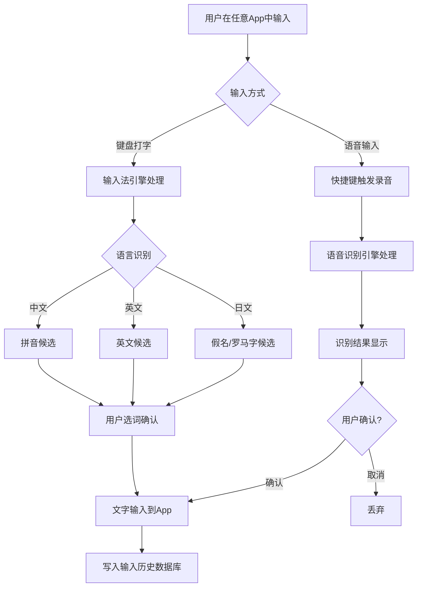
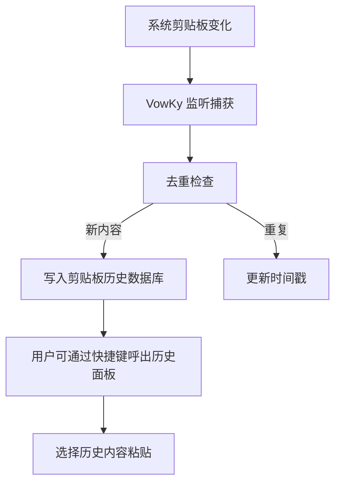
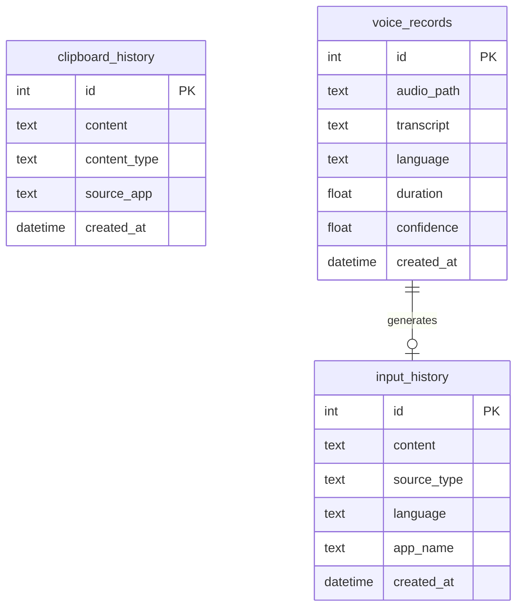

# VowKy - macOS 智能输入法 PRD V1.0

| 项目 | 内容 |
|------|------|
| 创建时间 | 2026-01-27 |
| 版本号 | V1.0 |
| 创建人 | - |
| 修订记录 | 首版 |
| 评审时间 | 待评审 |
| 评审结果 | 待评审 |

---

## 1、产品定位与目标

### 1.1 产品定位

> 一款 macOS 系统级输入法，支持中英日三语无缝切换、语音转文字替代打字、全量输入历史记录与剪贴板管理。未来分发给其他用户使用。

### 1.2 目标用户与使用场景

**目标用户**：
- 需要频繁使用中英日三语输入的 Mac 用户
- 追求高效输入、希望用语音替代打字的效率工具用户
- 需要回溯历史输入内容的知识工作者

**典型使用场景**：
- 场景1：工作中需要在中英日三语间频繁切换，不想反复切输入法
- 场景2：走路、思考时按住快捷键说话，语音直接转为文字输入到当前应用
- 场景3：想找回之前打过的一段话或复制过的内容，打开管理面板搜索历史记录

### 1.3 用户核心痛点

1. macOS 多语言输入法切换繁琐，中英日需要装多个输入法反复切换
2. 想用语音输入但系统自带的不够好用，识别准确率不高，不支持多语言
3. 打过的字、复制过的内容找不回来，没有统一的输入历史管理

### 1.4 产品价值

- **对用户**：一个输入法解决三语输入 + 语音转文字 + 输入回溯，提升日常输入效率
- **对平台**：切入输入法赛道，积累多语用户群，未来可扩展至更多语言和平台

---

## 2、功能清单与优先级

| 功能 | 描述 | 优先级 | 备注 |
|------|------|--------|------|
| 中英日三语键盘输入 | 单一输入法内支持中文拼音、英文、日文（假名/罗马字）输入，智能识别或快捷切换 | P0 | MVP |
| 语音转文字 | 快捷键触发录音，实时识别并输入到当前光标位置，支持中英日三语 | P0 | MVP |
| 输入历史记录 | 记录所有通过键盘和语音输入的文字，按时间线存储，支持搜索 | P0 | MVP |
| 剪贴板历史 | 监听系统剪贴板，记录所有复制内容，支持快捷粘贴历史内容 | P0 | MVP |
| 智能输入预测/联想 | 三语混合场景下的智能词句联想 | P1 | |
| 输入记录搜索与分类 | 按应用、时间、语言等维度分类和搜索历史输入 | P1 | |
| 跨平台同步 | iOS/Windows 等平台扩展，输入历史云同步 | P2 | |

---

## 3、核心策略

> 核心规则1：输入法作为 macOS Input Method 运行，全局可用于任何应用
> 核心规则2：所有输入（键盘/语音/剪贴板）统一存储，本地优先，保证隐私安全
> 核心规则3：语音识别采用高准确率引擎（Whisper 或同级），支持三语自动识别

---

## 4、用户旅程地图

| 阶段 | 用户动作 | 系统反馈 | 关键目标 |
|------|----------|----------|----------|
| 安装 | 下载安装 VowKy，在系统偏好设置中启用 | 引导开启输入法、辅助功能权限 | 完成激活 |
| 首次使用 | 在任意应用中切换到 VowKy 输入法 | 显示候选栏，支持中英日输入 | 体验三语输入 |
| 语音输入 | 按住快捷键说话 | 实时显示识别文字，松开后输入 | 感受语音效率 |
| 历史回溯 | 打开管理面板搜索之前的输入 | 按时间线展示历史记录 | 找到目标内容 |
| 日常使用 | 日常工作输入，偶尔查历史/粘贴板 | 输入流畅，历史可查 | 留存 |

---

## 5、流程图

### 5.1 输入流程



### 5.2 剪贴板监听流程



---

## 6、状态机

### 6.1 输入法状态机

```
[未激活] ──用户切换到VowKy──▶ [待机]
[待机] ──用户开始打字──▶ [输入中]
[输入中] ──选词/确认──▶ [已提交] ──▶ [待机]
[输入中] ──ESC/取消──▶ [待机]
[待机] ──快捷键按下──▶ [语音录音中]
[语音录音中] ──松开快捷键──▶ [语音识别中]
[语音识别中] ──识别完成──▶ [已提交] ──▶ [待机]
[语音识别中] ──识别失败──▶ [待机]（显示Toast提示）
```

---

## 7、数据结构与权限关系

### 7.1 数据结构表

| 表名 | 说明 | 主要字段 |
|------|------|----------|
| input_history | 输入历史 | id, content, source_type(keyboard/voice), language(zh/en/ja), app_name, created_at |
| clipboard_history | 剪贴板历史 | id, content, content_type(text/image/file), source_app, created_at |
| voice_records | 语音记录 | id, audio_path, transcript, language, duration, confidence, created_at |
| settings | 用户设置 | id, key, value |



### 7.2 存储方案

- 本地 SQLite 数据库，存储在 `~/Library/Application Support/VowKy/`
- 语音原始音频存储在本地文件系统，数据库记录路径
- 未来云同步通过增量同步策略实现（P2）

---

## 8、原型

待设计师出图后补充。

**核心界面**：
1. 输入法候选栏（嵌入系统输入法框架）
2. 语音输入浮窗（快捷键触发时显示）
3. 管理面板主窗口（独立App，包含输入历史、剪贴板历史、设置）

---

## 9、详细功能说明

### 9.1 中英日三语键盘输入

| 模块 | 页面 | 具体说明 |
|------|------|----------|
| 输入法候选栏 | 系统输入法候选窗口 | **前置来源:** 用户在任意App中开始打字<br><br>**交互说明:**<br>- 中文模式：拼音输入，显示候选词，数字键或空格选词<br>- 英文模式：直接输入，提供拼写建议<br>- 日文模式：罗马字输入，显示假名和汉字候选<br>- 语言切换：`Ctrl+Space` 在三语间循环切换，候选栏显示当前语言标识<br><br>**限制条件:**<br>- 候选词最多显示9个<br>- 候选窗口跟随光标位置 |

### 9.2 语音转文字

| 模块 | 页面 | 具体说明 |
|------|------|----------|
| 语音输入 | 语音浮窗 | **前置来源:** 用户按住快捷键（默认 `Option+Space`）<br><br>**交互说明:**<br>- 按住快捷键：显示录音浮窗，实时音量波形<br>- 说话过程中：实时显示识别中间结果（流式识别）<br>- 松开快捷键：完成识别，文字自动输入到光标位置<br>- 自动语言检测：无需手动切换语言<br><br>**提示文案:**<br>- 录音中："正在聆听..."<br>- 识别中："识别中..."<br>- 识别失败Toast："未识别到语音，请重试"（3秒）<br><br>**限制条件:**<br>- 单次录音最长60秒<br>- 需要麦克风权限 |

### 9.3 输入历史记录

| 模块 | 页面 | 具体说明 |
|------|------|----------|
| 输入历史 | 管理面板-历史页 | **前置来源:** 打开VowKy管理App，或快捷键 `Cmd+Shift+H` 唤起<br><br>**页面构成:**<br>- 搜索栏：全文搜索历史输入<br>- 筛选器：按语言(中/英/日)、来源(键盘/语音)、应用、日期筛选<br>- 时间线列表：按时间倒序展示输入记录<br>  - 每条记录：内容摘要、来源App图标、时间、语言标签<br>- 点击记录：复制到剪贴板<br><br>**排序逻辑:** 默认按时间倒序<br><br>**记录算法:**<br>- 键盘输入：每次确认提交（选词/回车）记录一次<br>- 语音输入：每次识别完成记录一次<br>- 去重规则：相同内容在10秒内不重复记录<br>- 合并规则：同一应用内连续输入，间隔<5秒的合并为一条记录 |

### 9.4 剪贴板历史

| 模块 | 页面 | 具体说明 |
|------|------|----------|
| 剪贴板 | 管理面板-剪贴板页 / 快捷浮窗 | **前置来源:** 快捷键 `Cmd+Shift+V` 唤起浮窗，或在管理App中查看<br><br>**页面构成:**<br>- 搜索栏：搜索历史剪贴板内容<br>- 列表：按时间倒序展示，显示内容预览+来源App+时间<br>- 点击：粘贴到当前应用<br>- 固定功能：常用内容可固定置顶<br><br>**记录算法:**<br>- 监听 NSPasteboard 变化<br>- 文本内容直接存储<br>- 图片存储缩略图+原图路径<br>- 文件类型记录文件名和路径<br>- 去重：连续相同内容不重复记录<br>- 存储上限：默认保留最近10000条，可在设置中调整 |

---

## 10、策略

### 10.1 语音识别策略

**技术方案**：
- **默认在线**：调用 OpenAI Whisper API（或同级云端服务），准确率最高，延迟约1-2秒
- **本地备用**：使用 whisper.cpp 本地运行，断网时自动回退，保证离线可用
- 本地模型选择：默认 `base` 模型，用户可在设置中切换 `small`/`medium` 模型
- 语言检测：Whisper 原生支持自动语言检测，中英日均在支持范围内
- 切换逻辑：设置中可选"在线优先（推荐）"/"仅本地"/"仅在线"，默认"在线优先"
- 在线不可用时（断网/API超时3秒）自动回退本地，Toast提示"已切换到离线模式"

**准确率目标**：
| 语言 | 目标准确率 | 测试条件 |
|------|-----------|----------|
| 中文普通话 | ≥95% | 安静环境，标准普通话 |
| 英文 | ≥95% | 安静环境，标准发音 |
| 日文 | ≥90% | 安静环境，标准发音 |

### 10.2 输入记录算法策略

**核心原则**：不遗漏、不重复、可回溯

**记录触发规则**：
| 输入方式 | 触发时机 | 记录内容 |
|----------|----------|----------|
| 键盘-中文 | 选词确认时 | 选定的词/句 |
| 键盘-英文 | 空格/回车/标点确认时 | 已输入的单词/短语 |
| 键盘-日文 | 选词确认时 | 选定的词/句 |
| 语音 | 识别完成并输入时 | 完整识别文本 |
| 剪贴板 | 系统剪贴板变化时 | 复制的内容 |

**智能合并算法**：
- 同一应用内，连续输入间隔 < 5秒 → 合并为一条记录
- 合并后的记录保留首次输入时间和最后输入时间
- 合并上限：单条记录不超过2000字符，超出自动分条

**去重规则**：
- 完全相同的内容在10秒内不重复记录
- 剪贴板连续复制相同内容不重复记录

**存储策略**：
- 输入历史：无上限，按月归档，超过6个月的自动压缩存储
- 剪贴板历史：默认10000条上限，FIFO淘汰
- 语音原始音频：默认保留30天，可设置永久保留

### 10.3 隐私与安全策略

- 所有数据默认仅存储在本地
- 密码输入框（SecureTextField）中的输入不记录
- 敏感应用排除：用户可设置不记录特定应用的输入
- 数据库加密：使用 SQLCipher 加密本地数据库
- 导出功能需要系统密码验证

### 10.4 异常处理【AI 补充】

| 异常场景 | 处理方式 | 提示文案 |
|----------|----------|----------|
| 麦克风无权限 | 弹窗引导开启权限 | "VowKy 需要麦克风权限才能使用语音输入，请在系统设置中开启" |
| 语音识别失败 | Toast提示 | "未识别到语音，请重试" |
| 输入法未激活 | 引导页面 | "请在系统设置 > 键盘 > 输入法中添加 VowKy" |
| 数据库写入失败 | 后台重试3次，失败后缓存到临时文件 | 无用户提示（静默处理） |
| 磁盘空间不足 | 弹窗提示 | "磁盘空间不足，历史记录可能无法保存，请清理磁盘" |

### 10.5 缺省态规范【AI 补充】

| 状态 | 文案 | 操作按钮 |
|------|------|----------|
| 输入历史为空 | "还没有输入记录，开始使用 VowKy 输入吧" | - |
| 剪贴板历史为空 | "还没有剪贴板记录，复制内容后自动记录" | - |
| 搜索无结果 | "未找到相关记录" | - |
| 语音模型加载中 | "语音模型加载中..." | - |

---

## 11、UI 设计

待设计师出图后补充。

**设计原则**：
- 遵循 macOS Human Interface Guidelines
- 输入法候选栏风格与系统原生一致
- 管理面板采用 macOS 原生窗口风格（NSWindow）

**核心视觉元素**：
- 语言切换指示器：候选栏左侧显示当前语言图标（中/EN/あ）
- 语音录音浮窗：圆形波形动画，悬浮于屏幕中央偏上
- 管理面板：左侧边栏导航（历史/剪贴板/设置），右侧内容区

**快捷键汇总**：
| 快捷键 | 功能 |
|--------|------|
| `Ctrl+Space` | 三语循环切换 |
| `Option+Space` | 语音输入（按住说话） |
| `Cmd+Shift+H` | 打开输入历史面板 |
| `Cmd+Shift+V` | 打开剪贴板历史浮窗 |

---

## 12、数据统计

### 12.1 埋点数据

| 事件名 | 触发时机 | 参数 |
|--------|----------|------|
| input_commit | 每次输入确认 | language, source_type, app_name, char_count |
| voice_start | 开始语音录音 | - |
| voice_complete | 语音识别完成 | language, duration, confidence, char_count |
| voice_fail | 语音识别失败 | error_type |
| clipboard_capture | 捕获剪贴板内容 | content_type, source_app |
| history_search | 搜索历史记录 | query_length, result_count |
| history_copy | 从历史中复制内容 | source_type |
| lang_switch | 切换输入语言 | from_lang, to_lang |

### 12.2 业务数据

| 指标名称 | 定义 | 统计周期 |
|----------|------|----------|
| 日活输入量 | 每日通过VowKy输入的总字符数 | 自然日 |
| 语音使用率 | 使用语音输入的次数 / 总输入次数 | 自然日 |
| 语言分布 | 中/英/日三语输入占比 | 自然周 |
| 历史查询率 | 搜索历史记录的用户占比 | 自然日 |
| 剪贴板使用率 | 从剪贴板历史中粘贴的次数 / 总粘贴次数 | 自然日 |

---

## 附录

### A. 技术选型建议

| 组件 | 建议方案 | 说明 |
|------|----------|------|
| 输入法框架 | macOS Input Method Kit (IMKit) | Apple 官方输入法开发框架 |
| 语音识别 | whisper.cpp | Whisper 的 C++ 移植，本地运行，支持中英日 |
| 本地数据库 | SQLite + SQLCipher | 加密存储，轻量高效 |
| 剪贴板监听 | NSPasteboard polling / DistributedNotificationCenter | macOS 系统 API |
| UI 框架 | SwiftUI + AppKit | macOS 原生开发 |
| 开发语言 | Swift + C++ (whisper.cpp) | 主体Swift，语音模块C++ |

### B. 已确认项

- [x] 语音识别：默认在线（高准确率），断网自动回退本地
- [x] iCloud 同步：MVP 不做，作为 P2 功能后续规划
- [x] 商业模式：暂不考虑，先做产品
- [x] 分发方式：Mac App Store + 官网独立分发双渠道（需 Apple Developer 账号，支持公证签名）

### C. AI 补充内容清单

- 异常处理（10.4）
- 缺省态规范（10.5）
- 隐私安全策略（10.3）
- 技术选型建议（附录A）
