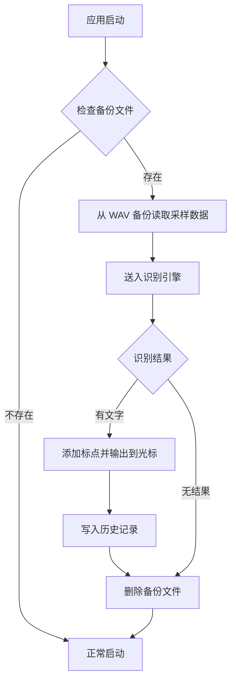

# VowKy - macOS 语音输入工具 PRD V1.1

| 项目 | 内容 |
|------|------|
| 创建时间 | 2026-01-27 |
| 版本号 | V1.1 |
| 创建人 | - |
| 修订记录 | V1.0 首版；V1.1（2026-02-17）基于代码梳理更新实现状态 |
| 评审时间 | 待评审 |
| 评审结果 | 待评审 |

---

## 1、产品定位与目标

### 1.1 产品定位

> 一款 macOS 菜单栏常驻语音输入工具，通过全局快捷键触发录音、离线语音识别并将文字直接输入到当前光标位置。本地优先，保证隐私安全。未来计划分发给其他用户使用。

**V1.1 修订说明**：根据实际代码实现，V1.0 中"系统级输入法"的定位调整为"菜单栏常驻语音输入工具"。当前版本不包含键盘输入法（IMKit）功能，专注于语音转文字输入场景。

### 1.2 目标用户与使用场景

**目标用户**：
- 需要频繁使用语音替代打字的 Mac 效率工具用户
- 在任意应用中需要快速输入中文文本的用户
- 对隐私敏感、偏好本地离线处理的用户

**典型使用场景**：
- 场景1：在任意应用中按下快捷键说话，语音直接转为文字输入到光标位置
- 场景2：走路、思考时触发语音输入，替代键盘打字
- 场景3：想找回之前说过的内容，打开历史面板搜索

### 1.3 用户核心痛点

1. macOS 系统自带语音听写不够灵活，无法自定义快捷键和交互方式
2. 在线语音服务有隐私顾虑，用户希望数据不出本机
3. 语音识别结果找不回来，没有历史记录管理

### 1.4 产品价值

- **对用户**：一键语音输入 + 离线识别 + 输入历史回溯，提升日常输入效率，保障隐私
- **对平台**：切入语音输入工具赛道，积累用户群，未来可扩展至更多语言和平台

---

## 2、功能清单与优先级

### 2.1 当前版本功能

| 功能 | 描述 | 优先级 | 实现状态 |
|------|------|--------|----------|
| 语音转文字 | 全局快捷键触发录音，离线识别并输入到当前光标位置 | P0 | 【已实现】 |
| 标点恢复 | 对识别结果自动添加标点符号（CT-Transformer 模型） | P0 | 【已实现】 |
| CGEvent 文字输出 | 通过键盘事件模拟将文字插入光标位置，不依赖剪贴板 | P0 | 【已实现】 |
| 录音浮窗 | 录音/识别过程中显示状态浮窗（音量指示、识别进度） | P0 | 【已实现】 |
| 菜单栏状态 | 菜单栏图标动态切换，弹窗显示状态和最近识别结果 | P0 | 【已实现】 |
| 识别历史记录 | SQLite 存储所有识别结果，支持浏览、搜索、删除 | P0 | 【已实现】 |
| 音频备份与崩溃恢复 | 录音过程实时备份 WAV 文件，崩溃后自动恢复识别 | P0 | 【已实现】 |
| 快捷键自定义 | 设置界面支持用户自定义触发快捷键 | P1 | 【已实现】 |
| 取消录音 | 录音过程中按 Escape 取消本次录音 | P1 | 【已实现】 |
| 权限检测与引导 | 启动时检查辅助功能权限，引导用户授权 | P1 | 【已实现】 |
| 快捷键冲突检测 | 检测 Option+Space 与系统输入法切换快捷键冲突 | P1 | 【已实现】 |
| 开机自启 | 设置界面支持开启/关闭登录时自动启动 | P2 | 【已实现】 |

### 2.2 规划中功能

| 功能 | 描述 | 优先级 | 实现状态 |
|------|------|--------|----------|
| 中英日三语键盘输入 | 单一输入法支持中文拼音、英文、日文输入 | P0 | 【未实现】 |
| 剪贴板历史 | 监听系统剪贴板，记录复制内容，支持快捷粘贴 | P0 | 【未实现】 |
| 多语言语音识别 | 支持英文、日文语音识别（自动语言检测） | P1 | 【未实现】 |
| 在线语音识别 | 在线 API 作为可选识别引擎（高准确率模式） | P1 | 【未实现】 |
| 智能输入预测/联想 | 三语混合场景下的智能词句联想 | P1 | 【未实现】 |
| 输入记录按维度分类 | 按应用、时间、语言等维度分类和搜索历史 | P1 | 【未实现】 |
| 跨平台同步 | iOS/Windows 平台扩展，历史记录云同步 | P2 | 【未实现】 |

---

## 3、核心策略

> 核心规则1：以菜单栏常驻应用形式运行，全局快捷键在任意应用中均可触发语音输入
> 核心规则2：语音识别采用本地离线引擎（sherpa-onnx + Paraformer），数据不出本机
> 核心规则3：文字输出通过 CGEvent 键盘模拟直接插入光标位置，不占用系统剪贴板
> 核心规则4：所有识别结果自动存储到本地 SQLite 数据库，支持历史回溯

---

## 4、用户旅程地图

| 阶段 | 用户动作 | 系统反馈 | 关键目标 |
|------|----------|----------|----------|
| 安装 | 下载安装 VowKy | 首次启动引导开启辅助功能权限；检测快捷键冲突并提示 | 完成权限授权 |
| 首次使用 | 在任意应用中按下 Option+Space | 屏幕上方出现录音浮窗，显示"正在聆听..."和音量条 | 开始录音 |
| 语音输入 | 说话，再次按下 Option+Space | 浮窗切换为"识别中..."，识别完成后文字自动插入光标位置，浮窗消失 | 完成语音输入 |
| 取消录音 | 录音过程中按 Escape | 录音取消，浮窗消失，备份删除 | 安全取消 |
| 查看历史 | 点击菜单栏图标，点击"查看全部历史" | 打开识别历史窗口，按时间倒序展示所有识别结果 | 找到目标内容 |
| 设置调整 | 点击菜单栏 > Settings | 打开设置窗口，可修改快捷键、查看权限状态、设置开机自启 | 自定义配置 |
| 崩溃恢复 | 应用异常退出后重新启动 | 自动检测到未完成的录音备份，恢复识别并输出结果 | 不丢失录音 |

---

## 5、流程图

### 5.1 语音输入流程

```mermaid
flowchart TD
    A[用户在任意App中] --> B[按下快捷键 Option+Space]
    B --> C{当前状态}
    C -->|loading| D[提示"模型加载中，请稍候"]
    C -->|idle| E[开始录音]
    C -->|recording| F[停止录音]
    C -->|recognizing/outputting| G[忽略操作]

    E --> H[显示录音浮窗]
    H --> I[实时备份音频到 WAV 文件]
    I --> J{用户操作}
    J -->|再次按快捷键| F
    J -->|按 Escape| K[取消录音]

    F --> L[语音识别 Paraformer]
    L --> M{识别结果}
    M -->|有文字| N[标点恢复 CT-Transformer]
    N --> O[CGEvent 模拟键盘输入文字]
    O --> P[写入历史数据库]
    P --> Q[删除备份文件]
    Q --> R[回到空闲状态]

    M -->|无结果| S[显示Toast"未识别到语音"]
    S --> T[删除备份文件]
    T --> R

    K --> U[删除备份文件]
    U --> R
```

### 5.2 崩溃恢复流程



---

## 6、状态机

### 6.1 应用状态机【已实现】

应用核心状态机包含 5 个状态，由 AppState 统一管理：

```
[loading] ──模型加载完成──▶ [idle]

[idle] ──按下快捷键──▶ [recording]

[recording] ──按下快捷键──▶ [recognizing]
[recording] ──按 Escape──▶ [idle]（取消录音，删除备份）

[recognizing] ──识别成功──▶ [outputting] ──输出完成──▶ [idle]
[recognizing] ──识别失败/为空──▶ [idle]（显示 Toast 3秒）

[loading] / [recognizing] / [outputting] 状态下──按快捷键──▶ 忽略
```

**状态说明**：
| 状态 | 含义 | 菜单栏图标 | 录音浮窗 |
|------|------|-----------|----------|
| loading | 模型加载中 | 空心麦克风 | 隐藏 |
| idle | 空闲就绪 | 空心麦克风 | 隐藏 |
| recording | 录音中 | 实心麦克风 | 显示：脉冲麦克风图标 + "正在聆听..." + 音量条 |
| recognizing | 识别中 | 空心麦克风 | 显示：进度指示器 + "识别中..." |
| outputting | 文字输出中 | 空心麦克风 | 隐藏 |

### 6.2 录音浮窗显示逻辑

- recording / recognizing 状态：显示浮窗
- recognizing -> idle 且无新结果：显示 Toast "未识别到语音，请重试"，3 秒后自动隐藏
- 识别成功（lastResult 更新）：立即隐藏浮窗
- 其他状态：隐藏浮窗

---

## 7、数据结构与权限关系

### 7.1 数据结构表【已实现】

| 表名 | 说明 | 主要字段 |
|------|------|----------|
| input_history | 识别历史 | id（自增主键）, content（文本，非空）, source_type（文本，默认 voice）, created_at（实数，Unix 时间戳） |

**V1.1 说明**：实际数据库仅包含 input_history 一张表，字段精简。V1.0 中规划的 clipboard_history、voice_records、settings 表尚未实现。

### 7.2 数据模型

```
HistoryRecord {
    id: Int           // 自增主键
    content: String   // 识别文本内容
    sourceType: String // 来源类型，默认 "voice"
    createdAt: Date   // 创建时间
}
```

### 7.3 存储方案

- 本地 SQLite 数据库（系统自带 sqlite3 C API，无第三方依赖）【已实现】
- 数据库路径：`~/Library/Application Support/VowKy/history.db`【已实现】
- 自动创建数据库目录和表结构【已实现】
- 默认查询上限：500 条，按时间倒序排列【已实现】
- 数据库加密（SQLCipher）【未实现】
- 云同步【未实现】

### 7.4 音频备份存储

- 备份格式：标准 WAV 文件（RIFF/WAVE，IEEE Float32，16kHz，单声道）【已实现】
- 备份路径：系统临时目录 / vowky_recording_backup.wav【已实现】
- 生命周期：录音开始时创建，识别完成或取消后删除；崩溃时保留供恢复【已实现】

### 7.5 权限要求

| 权限 | 用途 | 检查方式 |
|------|------|----------|
| 辅助功能（Accessibility） | CGEvent 键盘模拟输出文字、全局快捷键监听 | AXIsProcessTrusted()，启动时自动检查并引导授权【已实现】 |
| 麦克风（Microphone） | 录音 | 系统自动弹窗请求【已实现】 |

---

## 8、原型与界面描述

### 8.1 菜单栏图标【已实现】

- 常驻系统菜单栏，显示麦克风图标
- 录音中：实心麦克风图标（mic.fill）
- 其他状态：空心麦克风图标（mic）
- 点击弹出菜单窗口（MenuBarExtra .window 风格）

### 8.2 菜单栏弹窗【已实现】

宽度 220pt，包含以下区域（从上到下）：
- **状态指示**：彩色圆点 + 状态文字（Loading model... / Ready (Option+Space) / Recording... / Recognizing... / Outputting...）
- **识别历史**（有记录时显示）：标题"识别历史" + 最近 3 条识别结果（每条显示文字 + 复制按钮）+ "查看全部历史"链接
- **错误信息**（有错误时显示）：红色文字显示错误内容
- **Settings 按钮**：打开设置窗口
- **Quit VowKy 按钮**：退出应用

### 8.3 录音浮窗【已实现】

- 使用 NSPanel，浮动级别，非激活面板（不抢夺焦点）
- 位置：主屏幕可用区域顶部居中
- 尺寸：260 x 80pt
- 外观：HUD 风格毛玻璃背景，圆角 16pt
- 可跨所有 Space 和全屏应用显示
- 录音状态内容：脉冲红色麦克风图标 + "正在聆听..." + 绿色音量条
- 识别状态内容：旋转进度指示器 + "识别中..."
- 失败 Toast 内容：警告三角图标 + "未识别到语音，请重试"（3 秒后自动消失）

### 8.4 设置窗口【已实现】

独立 NSWindow，标题 "VowKy Settings"，尺寸 380 x 380pt，分组表单布局：

- **快捷键区域**：显示当前快捷键名称（如 ⌥Space），支持点击"修改"进入录制模式，按下新组合键完成设置，Escape 取消
- **语音模型区域**（只读显示）：模型名 Paraformer-zh (int8)，引擎 sherpa-onnx (本地)
- **权限区域**：辅助功能权限状态（已授权/未授权 + 前往设置按钮），麦克风权限（由系统管理）
- **通用区域**：开机自启开关（基于 SMAppService）

### 8.5 识别历史窗口【已实现】

独立 NSWindow，标题 "VowKy 识别历史"，初始尺寸 500 x 600pt，最小 400 x 400pt，可调整大小：

- **搜索栏**：顶部搜索框，实时模糊搜索，带清除按钮
- **记录列表**：按时间倒序展示，每条记录显示内容（最多 3 行）和时间（今天/昨天/日期格式）
- **悬停操作**：鼠标悬停时显示复制和删除按钮
- **空状态**：时钟图标 + "还没有输入记录" / "未找到相关记录"
- **底部状态栏**：显示总记录数 + "清空全部"按钮（红色）

---

## 9、详细功能说明

### 9.1 语音转文字【已实现】

| 模块 | 页面 | 具体说明 |
|------|------|----------|
| 语音输入 | 录音浮窗 | **前置条件:** 辅助功能权限已授权，语音模型已加载完成<br><br>**交互说明:**<br>- 按下全局快捷键（默认 Option+Space）：开始录音，显示录音浮窗<br>- 再次按下快捷键：停止录音，开始识别<br>- 识别完成：文字通过 CGEvent 键盘模拟直接输入到光标位置（非剪贴板方式）<br>- 录音过程中按 Escape：取消录音，回到空闲状态<br>- 识别结果为空：浮窗显示"未识别到语音，请重试"，3 秒后自动消失<br><br>**交互模式:** Toggle 模式（按一次开始录音，按一次停止录音），非按住说话模式<br><br>**限制条件:**<br>- 需要辅助功能权限和麦克风权限<br>- 模型加载期间按快捷键会提示"模型加载中，请稍候"<br>- 识别和输出过程中忽略快捷键操作 |

### 9.2 标点恢复【已实现】

| 模块 | 页面 | 具体说明 |
|------|------|----------|
| 标点服务 | 无独立界面 | **前置条件:** CT-Transformer 标点模型已加载<br><br>**功能说明:**<br>- 语音识别输出的纯文本自动添加标点符号<br>- 在识别完成后、文字输出前自动执行<br>- 模型未加载时降级为无标点（返回原文，不阻断流程）<br>- 离线运行，无需网络<br><br>**模型文件:** punct-model.onnx |

### 9.3 音频备份与崩溃恢复【已实现】

| 模块 | 页面 | 具体说明 |
|------|------|----------|
| 备份服务 | 无独立界面 | **功能说明:**<br>- 录音开始时创建 WAV 备份文件，录音过程中实时追加采样数据<br>- 正常完成（识别成功/取消）后自动删除备份<br>- 应用崩溃后重新启动时，检测到未删除的备份文件<br>- 自动从备份恢复采样数据，送入识别引擎，输出结果<br><br>**技术细节:**<br>- WAV 头实时更新，确保中途崩溃后文件仍可读取<br>- 备份文件位于系统临时目录，文件名固定 |

### 9.4 识别历史记录【已实现】

| 模块 | 页面 | 具体说明 |
|------|------|----------|
| 识别历史 | 菜单栏弹窗 + 历史窗口 | **前置来源:** 菜单栏弹窗点击"查看全部历史"<br><br>**菜单栏摘要:**<br>- 显示最近 3 条识别结果<br>- 每条记录可一键复制到剪贴板<br><br>**历史窗口:**<br>- 搜索栏：全文模糊搜索（LIKE 匹配）<br>- 时间线列表：按时间倒序展示全部识别记录<br>- 每条记录：内容（最多 3 行）+ 时间戳（今天/昨天/日期）<br>- 悬停操作：复制到剪贴板、删除单条记录<br>- 清空全部：底部一键清空所有历史<br>- 记录总数：底部状态栏显示<br><br>**记录触发规则:**<br>- 每次语音识别成功后自动写入<br>- 来源类型默认为 "voice"<br><br>**存储上限:** 默认查询 500 条（数据库无写入上限） |

### 9.5 全局快捷键【已实现】

| 模块 | 页面 | 具体说明 |
|------|------|----------|
| 快捷键管理 | 设置窗口 | **默认快捷键:** Option + Space（keyCode = 49）<br><br>**自定义设置:**<br>- 设置窗口中点击"修改"进入录制模式<br>- 按下任意键+修饰键组合完成设置<br>- 按 Escape（无修饰键）取消录制<br>- 支持 Option、Command、Control、Shift 四种修饰键任意组合<br>- 配置保存到 UserDefaults，重启后生效<br><br>**快捷键显示:** 修饰键符号（⌃⌥⇧⌘）+ 键名，覆盖字母、数字、功能键、方向键等<br><br>**事件处理:**<br>- 通过 CGEvent Tap 监听系统级键盘事件<br>- 过滤键盘重复事件，仅响应首次按下<br>- 快捷键 keyUp 事件被拦截不传递给系统<br>- 事件 Tap 超时后自动恢复 |

### 9.6 CGEvent 文字输出【已实现】

| 模块 | 页面 | 具体说明 |
|------|------|----------|
| 文字输出 | 无独立界面 | **功能说明:**<br>- 通过 CGEvent 键盘事件模拟将识别结果插入当前活跃应用的光标位置<br>- 不使用剪贴板，不影响用户已复制的内容<br>- 支持完整 Unicode 文本（中文、Emoji 等多字节字符）<br>- 长文本自动分块发送（每块最多 20 个 UTF-16 编码单元）<br>- 每个分块发送完整的 keyDown + keyUp 事件对<br><br>**前置条件:** 系统辅助功能权限已授权 |

### 9.7 权限管理与冲突检测【已实现】

| 模块 | 页面 | 具体说明 |
|------|------|----------|
| 权限检测 | 启动弹窗 + 设置窗口 | **辅助功能权限:**<br>- 应用启动时自动检查 AXIsProcessTrusted()<br>- 未授权时弹出引导对话框，提供"打开系统设置"和"稍后设置"两个选项<br>- 设置窗口中显示实时权限状态，未授权时提供"前往设置"按钮<br>- 录音前再次校验权限，未授权则显示错误提示<br><br>**快捷键冲突检测:**<br>- 启动时检测系统"选择上一个输入法"快捷键是否为 Option+Space<br>- 读取 com.apple.symbolichotkeys 中 key "61" 的配置<br>- 仅检测纯 Option+Space（不含 Command/Control 修饰键）的冲突<br>- 冲突时弹出警告，提供"打开键盘设置"选项 |

### 9.8 中英日三语键盘输入【未实现】

V1.0 规划的核心功能，需要基于 macOS Input Method Kit (IMKit) 开发系统级输入法，尚未开始实现。

### 9.9 剪贴板历史【未实现】

V1.0 规划的核心功能，需要监听 NSPasteboard 变化并记录历史，尚未开始实现。

---

## 10、策略

### 10.1 语音识别策略

**技术方案【已实现】**：
- **本地离线优先**：使用 sherpa-onnx 引擎 + FunASR Paraformer 模型，完全离线运行
- 模型类型：Paraformer（INT8 量化，model.int8.onnx）
- 词表文件：tokens.txt
- 采样率：16000 Hz，特征维度 80
- 推理方式：离线（Offline）模式，录音结束后一次性送入全部采样解码
- 在线 API 备选方案：预留了 APIClient 占位文件，尚未实现

**V1.1 修订说明**：V1.0 规划的"默认在线 Whisper API + 本地 whisper.cpp 备用"方案已调整为"本地 sherpa-onnx + Paraformer 优先"方案。当前版本仅支持离线识别。

**标点恢复【已实现】**：
- 使用 CT-Transformer 离线标点预测模型（punct-model.onnx）
- 在识别结果输出前自动添加标点
- 模型未就绪时降级为无标点，不影响主流程

**准确率目标**：
| 语言 | 目标准确率 | 实现状态 |
|------|-----------|----------|
| 中文普通话 | ≥95% | 【已实现】Paraformer 模型 |
| 英文 | ≥95% | 【未实现】 |
| 日文 | ≥90% | 【未实现】 |

### 10.2 音频录制策略【已实现】

- 使用 AVAudioEngine 捕获麦克风输入
- 通过 AVAudioConverter 实时重采样为 16kHz 单声道 Float32
- 使用 NSLock 保护采样数据数组的线程安全
- 实时计算 RMS 音量等级供 UI 显示
- 录音过程中通过备份服务实时写入 WAV 文件
- 支持测试模式：通过环境变量 VOWKY_TEST_AUDIO 加载测试音频文件

### 10.3 隐私与安全策略

- 所有语音识别在本地完成，数据不出本机【已实现】
- 识别历史存储在本地 SQLite 数据库【已实现】
- 音频备份仅在录音期间临时存在，完成后删除【已实现】
- 密码输入框中的输入不记录【未实现】
- 敏感应用排除列表【未实现】
- 数据库加密（SQLCipher）【未实现】
- 导出功能需密码验证【未实现】

### 10.4 异常处理

| 异常场景 | 处理方式 | 实现状态 |
|----------|----------|----------|
| 辅助功能未授权 | 启动时弹窗引导；录音前检查并提示错误 | 【已实现】 |
| 快捷键与系统冲突 | 启动时检测并弹窗警告 | 【已实现】 |
| 语音识别无结果 | 浮窗显示 Toast "未识别到语音，请重试"，3 秒后消失 | 【已实现】 |
| 应用崩溃丢失录音 | 重启时自动从 WAV 备份恢复识别 | 【已实现】 |
| 模型文件缺失 | 静默返回，不触发 fatalError（上层检查文件存在性） | 【已实现】 |
| 标点模型未加载 | 降级为无标点输出 | 【已实现】 |
| 录音格式转换失败 | 抛出具体错误枚举 | 【已实现】 |
| CGEvent Tap 超时 | 自动重新启用 Tap | 【已实现】 |
| 数据库写入失败 | 静默处理，不影响主流程 | 【已实现】 |
| 麦克风无权限 | 系统自动弹窗请求 | 【已实现】 |
| 磁盘空间不足 | 未专门处理 | 【未实现】 |

### 10.5 缺省态规范

| 状态 | 文案 | 实现状态 |
|------|------|----------|
| 识别历史为空 | "还没有输入记录"（搜索无结果："未找到相关记录"） | 【已实现】 |
| 模型加载中 | 菜单栏状态文字 "Loading model..." | 【已实现】 |
| 空闲就绪 | 菜单栏状态文字 "Ready (Option+Space)" | 【已实现】 |

---

## 11、UI 设计

### 11.1 设计原则

- 遵循 macOS Human Interface Guidelines【已实现】
- 菜单栏弹窗使用 MenuBarExtra .window 风格【已实现】
- 独立窗口（设置、历史）使用 NSWindow + NSHostingController 模式【已实现】
- 录音浮窗使用 NSPanel + NSVisualEffectView 毛玻璃效果【已实现】
- 应用为纯菜单栏应用（LSUIElement = true），不显示 Dock 图标【已实现】

### 11.2 核心视觉元素

- **菜单栏图标**：SF Symbol 麦克风图标（mic / mic.fill），录音时切换为实心【已实现】
- **录音浮窗**：HUD 风格毛玻璃背景，圆角 16pt，脉冲动画麦克风图标 + 绿色音量条【已实现】
- **状态颜色**：loading=橙色, idle=绿色, recording=红色, recognizing=黄色, outputting=蓝色【已实现】

### 11.3 快捷键汇总

| 快捷键 | 功能 | 实现状态 |
|--------|------|----------|
| Option+Space（可自定义） | 切换录音/停止录音 | 【已实现】 |
| Escape | 取消录音 | 【已实现】 |
| Ctrl+Space | 三语循环切换 | 【未实现】 |
| Cmd+Shift+H | 打开输入历史面板 | 【未实现】（通过菜单栏入口访问） |
| Cmd+Shift+V | 打开剪贴板历史浮窗 | 【未实现】 |

---

## 12、数据统计

### 12.1 埋点数据

| 事件名 | 触发时机 | 实现状态 |
|--------|----------|----------|
| voice_start | 开始语音录音 | 【未实现】 |
| voice_complete | 语音识别完成 | 【部分实现】结果写入 HistoryStore |
| voice_fail | 语音识别失败 | 【未实现】 |
| voice_cancel | 用户取消录音 | 【未实现】 |
| history_search | 搜索历史记录 | 【未实现】 |
| history_copy | 从历史中复制内容 | 【未实现】 |
| crash_recovery | 崩溃恢复成功 | 【未实现】 |

### 12.2 业务数据

当前版本未实现正式的数据统计模块。HistoryStore 提供基础的记录总数查询（count）。

---

## 附录

### A. 技术选型

| 组件 | 方案 | 实现状态 |
|------|------|----------|
| 应用形态 | macOS 菜单栏常驻应用（MenuBarExtra） | 【已实现】 |
| 开发语言 | Swift | 【已实现】 |
| UI 框架 | SwiftUI + AppKit（NSPanel / NSWindow） | 【已实现】 |
| 构建工具 | XcodeGen（project.yml） | 【已实现】 |
| 语音识别引擎 | sherpa-onnx（xcframework + libonnxruntime） | 【已实现】 |
| 语音识别模型 | FunASR Paraformer-zh（INT8 量化） | 【已实现】 |
| 标点恢复模型 | CT-Transformer（punct-model.onnx） | 【已实现】 |
| 音频录制 | AVAudioEngine + AVAudioConverter | 【已实现】 |
| 文字输出 | CGEvent 键盘模拟（CGEventKeyboardSetUnicodeString） | 【已实现】 |
| 全局快捷键 | CGEvent Tap（keyDown/keyUp/flagsChanged） | 【已实现】 |
| 本地数据库 | SQLite3 C API（系统自带） | 【已实现】 |
| 开机自启 | SMAppService | 【已实现】 |
| 部署目标 | macOS 13.0+ | 【已实现】 |
| Bundle ID | com.vowky.app | 【已实现】 |
| 输入法框架 | macOS Input Method Kit (IMKit) | 【未实现】 |
| 数据库加密 | SQLCipher | 【未实现】 |
| 在线语音 | OpenAI Whisper API 或同级 | 【未实现】（APIClient 占位） |

### B. 架构概览

```
VowKyApp (入口, @main)
  ├── AppDelegate (启动检查：辅助功能权限 + 快捷键冲突)
  ├── AppState (核心状态机, @MainActor, 单一事实来源)
  │     ├── SpeechRecognizerProtocol → LocalSpeechRecognizer
  │     ├── AudioRecorderProtocol → AudioRecorder
  │     ├── PermissionCheckerProtocol → RealPermissionChecker
  │     ├── PunctuationServiceProtocol → PunctuationService (可选)
  │     ├── AudioBackupProtocol → AudioBackupService (可选)
  │     ├── HotkeyManager (CGEvent Tap)
  │     ├── TextOutputService (CGEvent 键盘模拟)
  │     ├── RecordingPanel (NSPanel 录音浮窗)
  │     └── HistoryStore.shared (SQLite 单例)
  └── MenuBarView (菜单栏弹窗)
        ├── SettingsWindowController → SettingsView
        └── HistoryWindowController → HistoryView
```

**设计模式**：
- 协议驱动的依赖注入：核心服务均通过协议定义接口，生产实现在 VowKyApp 入口注入
- @MainActor 状态机：所有状态变更在主线程执行
- 后台模型加载：语音模型和标点模型通过 Task.detached 在后台线程加载，避免阻塞 UI

### C. SherpaOnnx 封装层能力

SherpaOnnx.swift 作为 C API 的 Swift 封装层，提供了远超当前使用范围的能力。以下列出已封装但尚未在产品中使用的模块，供未来扩展参考：

| 模块 | 说明 | 使用状态 |
|------|------|----------|
| 离线 Paraformer 识别 | 当前使用的语音识别方案 | 【在用】 |
| 离线 CT-Transformer 标点 | 当前使用的标点恢复方案 | 【在用】 |
| 在线流式识别 | Transducer/Paraformer/Zipformer 等多种模型 | 【已封装未使用】 |
| 语音活动检测（VAD） | Silero/TEN 模型 | 【已封装未使用】 |
| 离线 TTS 语音合成 | VITS/Matcha/Kokoro 等 6 种模型 | 【已封装未使用】 |
| 口语语言识别 | 基于 Whisper 的语言检测 | 【已封装未使用】 |
| 关键词检测 | 流式关键词检测 | 【已封装未使用】 |
| 说话人分离 | 离线说话人分割与聚类 | 【已封装未使用】 |
| 语音降噪 | GTCRN 模型 | 【已封装未使用】 |

### D. 已确认项

- [x] 语音识别：本地离线优先（sherpa-onnx + Paraformer）
- [x] 文字输出：CGEvent 键盘模拟（不使用剪贴板）
- [x] 快捷键模式：Toggle 模式（按一次开始，按一次停止）
- [x] iCloud 同步：当前不做，后续规划
- [x] 商业模式：暂不考虑，先做产品
- [x] 分发方式：Mac App Store + 官网独立分发双渠道

### E. 测试覆盖

项目包含 99 个测试用例，按层级组织：
- Unit/ — 单个服务测试（识别器、音频、备份、标点、快捷键逻辑）
- StateMachine/ — AppState 状态转换测试
- HotkeyLogic/ — HotkeyEvaluator 纯函数测试
- System/ — CGEvent tap、模拟、音频捕获（需辅助功能权限）
- Integration/ — 完整流程、回调链、线程安全

Mock 实现位于 VowKyTests/Mocks/TestMocks.swift。
