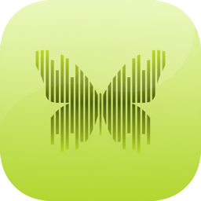

<p align="center">
  
</p>

<h1 align="center">VowKy</h1>

<p align="center">
  <b>macOS 菜单栏语音工具</b><br>
  即时输入 · 文件转写 · 完全离线 · 隐私至上
</p>

<p align="center">
  <a href="https://vowky.com">官网</a> ·
  <a href="https://github.com/KF330330/vowky/releases/latest">下载</a> ·
  <a href="#功能特性">功能</a> ·
  <a href="#从源码构建">构建</a>
</p>

<p align="center">
  
  
  
  
</p>

---

## 它做什么

VowKy 有两个使用场景：

**① 快捷键即时输入**

> **Option + Space** → 说话 → 再按一次 → 文字出现在光标位置。

在任何应用的任何输入框中使用 —— 浏览器、编辑器、微信、备忘录，无处不在。

**② 本地音视频文件转写**

> 把音频 / 视频文件拖进 VowKy → 离线转写 → 输出 `.md` Markdown 文件。

采访录音、会议记录、播客、教程视频，一拖即转。支持中文、日语、英语自动识别，长文件自动分块。

**所有处理在你的 Mac 上完成，不经过任何服务器。**

## 功能特性

- **完全离线** — 基于 [Sherpa-ONNX](https://github.com/k2-fsa/sherpa-onnx) 本地模型，断网也能用，飞行模式也能用
- **隐私至上** — 零网络请求，零数据上传，你的声音不离开这台电脑
- **三语识别** — 中文、日语、英语自动检测，无需手动切换语言
- **全局输入** — 通过 CGEvent 键盘模拟直接输入文字，不占用剪贴板
- **即时响应** — 本地推理，毫秒级延迟，自动补全标点符号
- **文件转写** — 拖入音频 / 视频文件，离线转写，长文件自动分块
- **Markdown 输出** — 转写结果保存为 `.md` 文件，带 YAML frontmatter（原文件名、时长、模型、时间戳）
- **AI 后处理（可选）** — 转写完成后调用本机已有的 `Codex CLI` 或 `Claude Code CLI` 生成标题、摘要、分段，不需要单独申请 API Key
- **极简设计** — 菜单栏常驻，不占 Dock，自定义快捷键，Escape 随时取消
- **历史记录** — SQLite 存储所有识别结果，随时回顾
- **自动更新** — 内置 [Sparkle](https://sparkle-project.org/) 自动更新

## 技术栈

| 组件 | 技术 |
|------|------|
| 语音识别 | Sherpa-ONNX（Paraformer / SenseVoice） |
| 标点恢复 | Sherpa-ONNX CT-Transformer |
| 音频采集 | AVAudioEngine (16kHz mono Float32) |
| 文字输出 | CGEvent 键盘模拟 |
| 全局快捷键 | CGEvent Tap |
| 数据存储 | SQLite3 C API |
| 转写输出 | Markdown + YAML frontmatter |
| AI 后处理 | Codex CLI / Claude Code CLI（本机调用） |
| 自动更新 | Sparkle 2 |
| UI | SwiftUI MenuBarExtra |
| 构建工具 | XcodeGen |

## 从源码构建

### 前置条件

- macOS 13.0 Ventura 或更高版本
- Xcode 16.0+
- [XcodeGen](https://github.com/yonaskolb/XcodeGen)：`brew install xcodegen`

### 构建步骤

```bash
# 1. 克隆仓库（.onnx 模型和 .a 库用 Git LFS 存储）
git clone https://github.com/KF330330/vowky.git
cd vowky
git lfs pull

# 2. 在 VowKy/project.yml 中设置你的 Apple Developer Team ID
#    找到 DEVELOPMENT_TEAM: "" 并填入你的 Team ID（否则 TCC 权限授权会失败）

# 3. 一键构建并启动
make run
```

或手动分步：

```bash
cd VowKy
xcodegen generate
xcodebuild -project VowKy.xcodeproj -scheme VowKy -configuration Debug build
open ~/Library/Developer/Xcode/DerivedData/VowKy-*/Build/Products/Debug/VowKy.app
```

### 运行测试

```bash
cd VowKy
xcodegen generate
xcodebuild test -project VowKy.xcodeproj -scheme VowKy -configuration Debug
```

## 项目结构

```
vowky/
├── VowKy/                    # macOS 原生应用
│   ├── project.yml           # XcodeGen 项目配置
│   ├── VowKy/
│   │   ├── VowKyApp.swift    # 入口，依赖注入
│   │   ├── AppState.swift    # 状态机（idle → recording → recognizing → idle）
│   │   ├── Services/         # 业务服务（协议 + 实现）
│   │   ├── Views/            # SwiftUI 视图
│   │   ├── SherpaOnnx/       # Sherpa-ONNX 桥接
│   │   └── Resources/        # 模型文件、图标、音频、Release Notes
│   ├── VowKyTests/           # 单元测试 & 集成测试
│   └── Libraries/            # Sherpa-ONNX 原生库 (Git LFS)
├── deploy/                   # 构建、签名、公证、发布脚本
└── Makefile                  # 快捷命令（make run / make deploy 等）
```

## 官网

在线访问：**[vowky.com](https://vowky.com)**

## 交流

扫码加微信，一起聊聊 VowKy：

<p align="center">
  
</p>

## 许可证

[MIT](LICENSE)

## 致谢

- [Sherpa-ONNX](https://github.com/k2-fsa/sherpa-onnx) — 离线语音识别引擎
- [Sparkle](https://github.com/sparkle-project/Sparkle) — macOS 自动更新框架
- [XcodeGen](https://github.com/yonaskolb/XcodeGen) — Xcode 项目生成器
